# Code Deploy 연동

## 3. Code Deploy 연동

### 3-1. 배포 설정 파일 추가

제일 먼저 member-batch 프로젝트 안에 code-deploy 디렉토리를 생성합니다.  
그리고 아래 그림처럼 2개의 파일을 생성합니다.  


Code Deploy는 배포를 어떻게 진행할지를 ```appspec.yml```로 결정합니다.  
여기서 **jar의 권한이나 실행시킬 스크립트 등을 지정**할 수 있습니다.  
  
**appspec.yml**

```yaml
version: 0.0
os: linux
files:
  - source:  /
    destination: /home/jenkins/member-batch/deploy

permissions:
  - object: /
    pattern: "**"
    owner: jenkins
    group: jenkins

hooks:
  ApplicationStart:
    - location: deploy.sh
      timeout: 60
      runas: ec2-user
```


* ```files.destination: /home/jenkins/member-batch/deploy```
    * Code Deploy로 배포하게 되면 배포되는 서버의 ```/opt/codedeploy-agent/deployment-root/어플리케이션ID/배포그룹 ID``` 에 저장됩니다
    * 배포될 서버의 ```/home/jenkins/member-batch/deploy```로 배포 파일들을 모두 옮긴다는 의미입니다.
* ```permissions```
    * 모든 실행 권한을 ```jenkins:jenkins```로 하겠다는 의미입니다.

* ```hooks.ApplicationStart```
    * **배포 파일을 모두 옮긴 후**, 지정한 파일 (```deploy.sh```)를 실행합니다.
    * 좀 더 다양한 Event Cycle을 원하신다면 [공식 가이드](https://docs.aws.amazon.com/ko_kr/codedeploy/latest/userguide/reference-appspec-file-structure-hooks.html)를 참고하세요.

appspec.yml 생성이 끝나셨으면, 다음으로는 deploy.sh를 생성하겠습니다.  
appspec.yml과 마찬가지로 member-batch/code-deploy에 생성합니다.  
  
**deploy.sh**

```bash
ORIGIN_JAR_PATH='/home/jenkins/member-batch/deploy/*.jar'
ORIGIN_JAR_NAME=$(basename ${ORIGIN_JAR_PATH})
TARGET_PATH='/home/jenkins/member-batch/application.jar'
JAR_BOX_PATH='/home/jenkins/member-batch/jar/'

echo "  > 배포 JAR: "${ORIGIN_JAR_NAME}

echo "  > chmod 770 ${ORIGIN_JAR_PATH}"
sudo chmod 770 ${ORIGIN_JAR_PATH}

echo "  > cp ${ORIGIN_JAR_PATH} ${JAR_BOX_PATH}"
sudo cp ${ORIGIN_JAR_PATH} ${JAR_BOX_PATH}

echo "  > chown -h jenkins:jenkins ${JAR_BOX_PATH}${ORIGIN_JAR_NAME}"
sudo chown -h jenkins:jenkins ${JAR_BOX_PATH}${ORIGIN_JAR_NAME}

echo "  > sudo ln -s -f ${JAR_BOX_PATH}${ORIGIN_JAR_NAME} ${TARGET_PATH}"
sudo ln -s -f ${JAR_BOX_PATH}${ORIGIN_JAR_NAME} ${TARGET_PATH}
```

* 배포 파일들 중, jar파일을 찾아 jar를 모아두는 디렉토리 (```JAR_BOX_PATH```)로 복사
* 복사된 jar 파일의 권한을 ```jenkins:jenkins```로 변경
* 심볼릭 링크로 application.jar에 배포된 jar 파일 연결

자 이제 프로젝트 설정까지 끝이 났습니다!  
잘 되는지 Code Deploy 테스트를 한번 수행해보겠습니다!

### 3-2. Batch Jenkins 서버 설정

먼저 Batch Jenkins 서버에 Code Deploy agent를 설치하겠습니다.  
  

필요한 패키지 업데이트를 먼저 하고

```bash
sudo yum update
sudo yum install ruby
sudo yum install wget
```

agent를 설치합니다.

```bash
cd /home/ec2-user
wget https://aws-codedeploy-ap-northeast-2.s3.amazonaws.com/latest/install
chmod +x ./install
sudo ./install auto
```

설치 및 실행이 잘 되었는지 확인해봅니다.

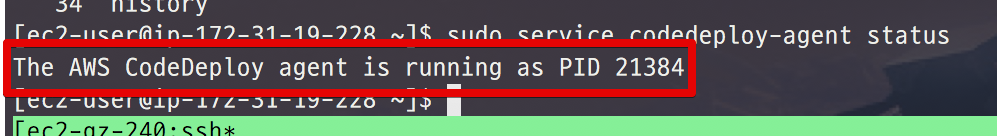

```bash
sudo service codedeploy-agent status
```

agent가 설치되었으니, **deploy.sh에 작성된 디렉토리들을 미리 생성**하겠습니다.

젠킨스는 Spring Batch Jar를 실행할때 사용자가 jenkins인채로 실행하기 때문에 모든 파일과 디렉토리를 jenkins 사용자를 기준으로 합니다.  
(ec2-user가 아닙니다.)  
  
일단 home에 jenkins를 추가하겠습니다.


```bash
cd /home
sudo mkdir jenkins
```

그리고 하위 디렉토리를 생성합니다.


```bash
sudo mkdir /home/jenkins/member-batch
sudo mkdir /home/jenkins/member-batch/deploy
sudo mkdir /home/jenkins/member-batch/jar
```

그리고 이들의 권한을 모두 jenkins로 전환합니다.


```bash
sudo chown -R jenkins:jenkins /home/jenkins
```

생성된 모든 디렉토리의 사용자:그룹 권한이 ```jenkins:jenkins```로 변경되었습니다.  
EC2의 작업이 끝났으니 다시 프로젝트로 돌아가겠습니다.

### 3-3. Code Deploy 테스트

Code Deploy가 소스코드를 가져오는 방법은 크게 2가지가 있습니다.  

* Github의 특정 커밋을 기준으로 가져오기
* S3에 올라간 zip 파일을 가져오기

Github에서 코드를 가져오는 방식은 지금과 같이 **member-batch만 빌드해서 가져오기가 불편**합니다.  
그래서 S3에 zip 파일을 올려서 테스트 해보겠습니다.

> 이 과정은 이후 배포 Jenkins에서 자동화 되어 진행될 예정입니다.

먼저 Root 프로젝트의 ```gradlew```를 이용하여 member-batch만 build 합니다.

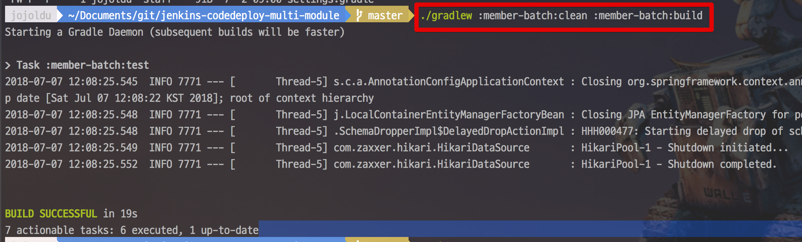

```bash
./gradlew :member-batch:clean :member-batch:build
```

그리고 디렉토리 하나를 생성하여 **Code Deploy 배포에 필요한 모든 파일을 복사**합니다.


```bash
mkdir -p code-deploy-member-batch
cp member-batch/code-deploy/*.yml code-deploy-member-batch 
cp member-batch/code-deploy/*.sh code-deploy-member-batch
cp member-batch/build/libs/*.jar code-deploy-member-batch
```

복사된 디렉토리를 통째로 zip 파일로 만듭니다.

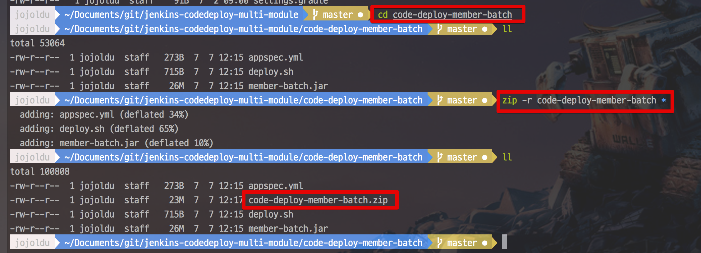

```bash
zip -r code-deploy-member-batch *
```

이렇게 생성된 zip 파일을 1-3 에서 만든 S3 Bucket에 업로드 합니다.

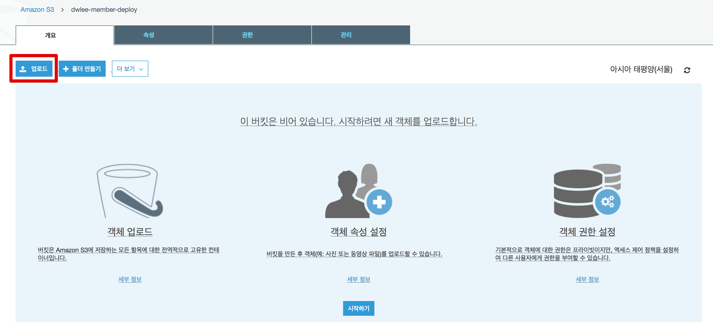

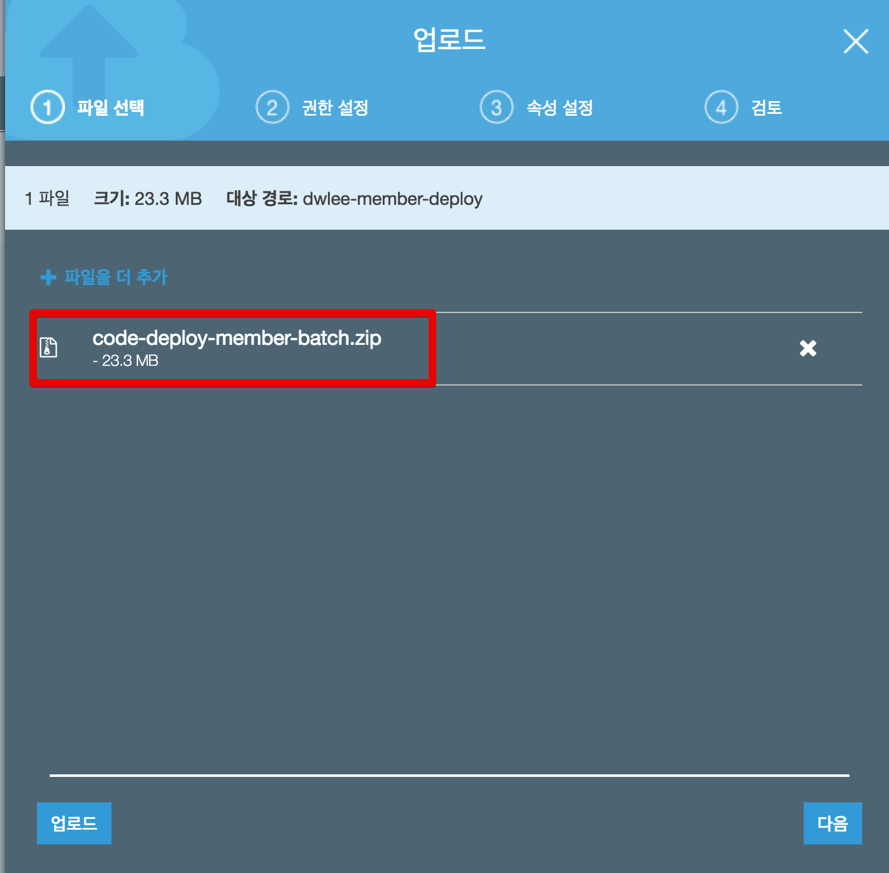

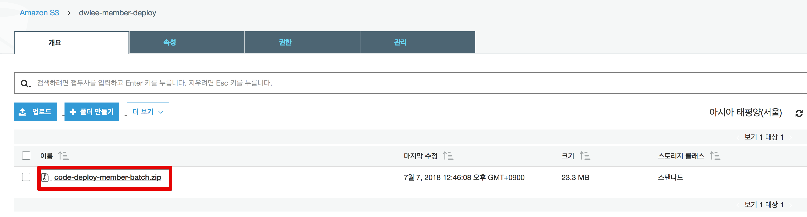

업로드 된 파일의 상세 정보 페이지로 가보시면 아래와 같은 링크가 나옵니다.

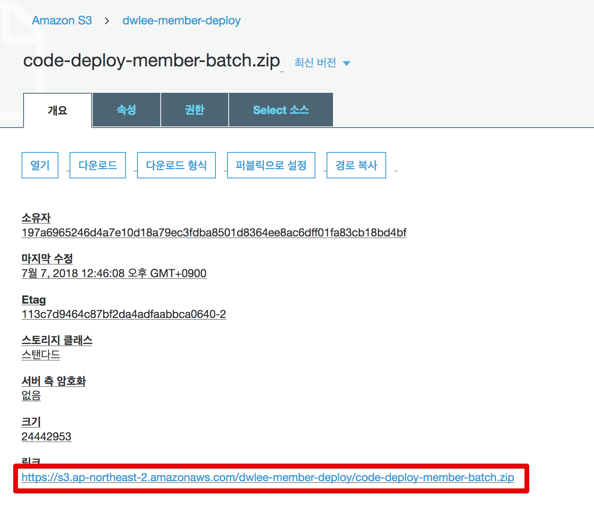

링크를 복사하시고, Code Deploy 페이지로 이동합니다.

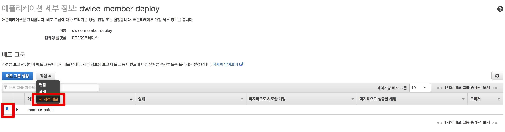

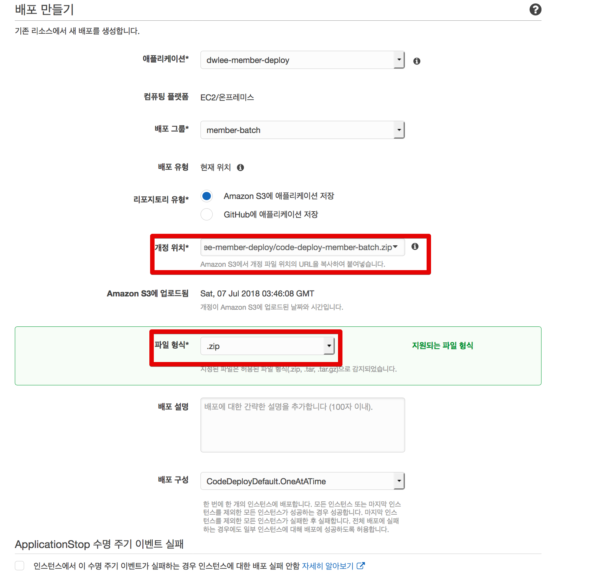

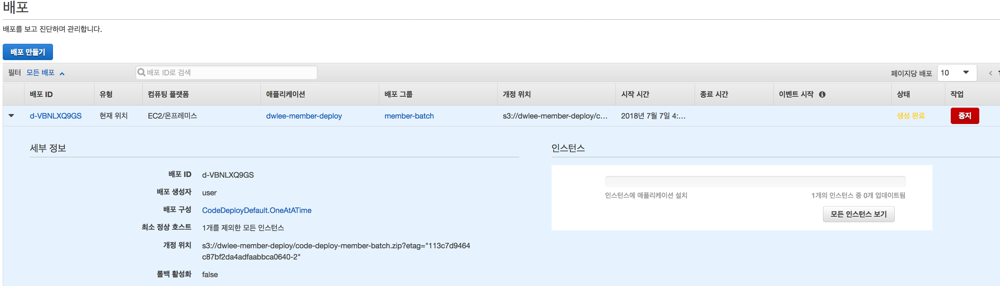

Code Deploy 상태가 성공으로 변하면 배포가 성공한 것입니다.

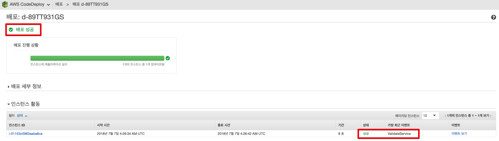

자 Batch 서버에서도 한번 확인해보겠습니다.  

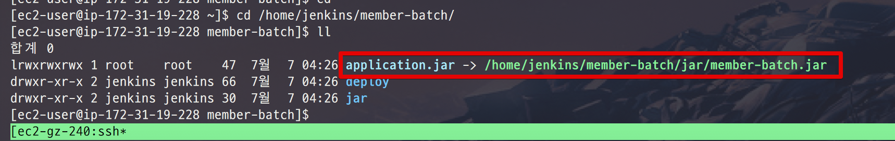

심볼링 링크로 application.jar와 member-batch.jar가 아주 잘 연결되어있음을 확인할 수 있습니다!  
  
그럼 마지막으로 이 배치 파일을 실행해보겠습니다.


```bash
sudo -H -u jenkins java -jar $(readlink /home/jenkins/member-batch/application.jar) --job.name=sampleBatch version=test
```

**Code Deploy로 배포된 jar 배치 수행**까지 테스트 되었습니다!  
자 이제 배포 Jenkins에서 이 과정을 대신 처리하도록 수정해보겠습니다!