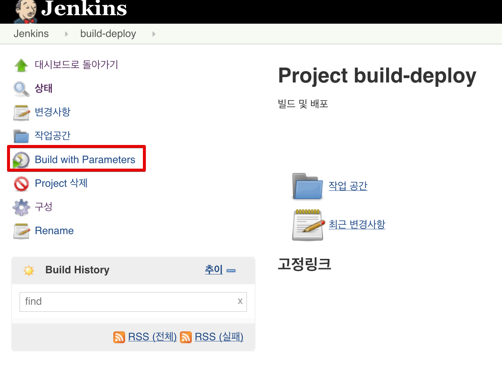
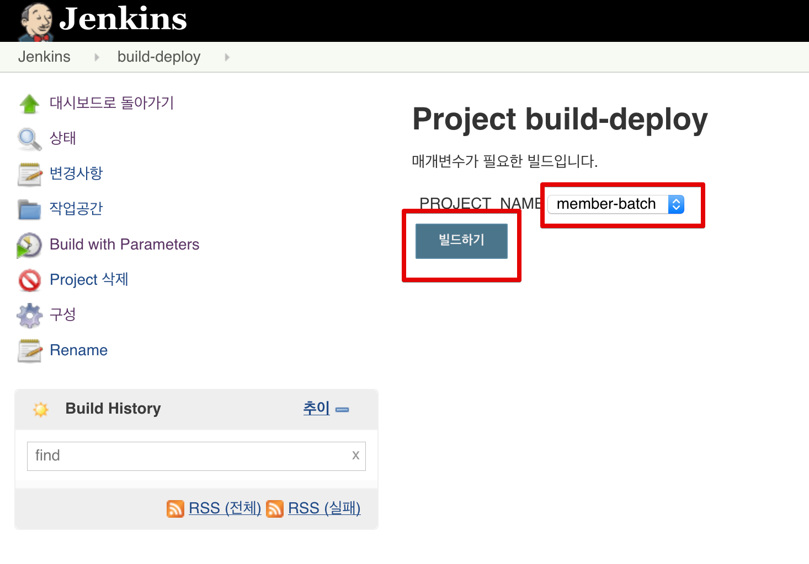
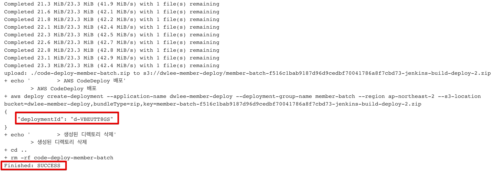
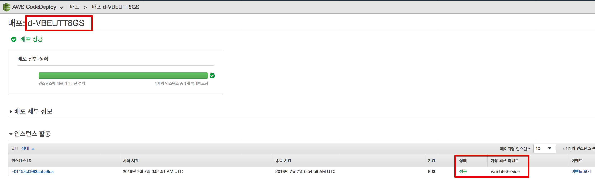

# 젠킨스 연동

## 4. 배포 Jenkins 환경 설정

여기서는 **Batch가 아닌 배포 Jenkins** 페이지로 이동합니다.  
배포 Jenkins에서 Github에 올라간 코드를 가져오려면 Github과 연동이 필요합니다.  

> Jenkins와 Github 연동은 [이전에 작성된 포스팅](http://jojoldu.tistory.com/291)를 참고해서 진행하시는것을 추천드립니다.

**연동이 되셨으면** 배포 Job을 생성하겠습니다.


매개변수 (파라미터)에는 **Choice Parameter**를 선택합니다.


* 여기서는 member-batch 모듈만 있어서 member-batch 만 등록했지만, member-api, member-admin 등 여러 모듈이 있다면 다 등록하시면 됩니다.


소스코드 관리에서는 배포할 프로젝트의 Github 주소를 등록합니다.


배포 스크립트 내용은 좀 길어서 아래 코드를 그대로 복사해주세요.


```bash
DEPLOY_DIR_NAME=code-deploy-${PROJECT_NAME}
APP_NAME='dwlee-member-deploy'
BUCKET='dwlee-member-deploy'
ZIP_NAME=${PROJECT_NAME}-${GIT_COMMIT}-${BUILD_TAG}.zip

./gradlew :${PROJECT_NAME}:clean :${PROJECT_NAME}:build

echo "	> 배포.zip 생성"
mkdir -p ${DEPLOY_DIR_NAME}
cp ${PROJECT_NAME}/code-deploy/*.yml ${DEPLOY_DIR_NAME}/
cp ${PROJECT_NAME}/code-deploy/*.sh ${DEPLOY_DIR_NAME}/
cp ${PROJECT_NAME}/build/libs/*.jar ${DEPLOY_DIR_NAME}/

cd ${DEPLOY_DIR_NAME}
zip -r ${DEPLOY_DIR_NAME} *

echo "	> AWS S3 업로드"
aws s3 cp ${DEPLOY_DIR_NAME}.zip s3://${BUCKET}/${ZIP_NAME} --region ap-northeast-2

echo "	> AWS CodeDeploy 배포"
aws deploy create-deployment \
--application-name ${APP_NAME} \
--deployment-group-name ${PROJECT_NAME} \
--region ap-northeast-2 \
--s3-location bucket=${BUCKET},bundleType=zip,key=${ZIP_NAME}

echo "	> 생성된 디렉토리 삭제"
cd ..
rm -rf ${DEPLOY_DIR_NAME}
```

* ```./gradlew :${PROJECT_NAME}:clean :${PROJECT_NAME}:build```
    * 멀티 모듈 프로젝트이기 때문에 **지정한 프로젝트만** ( ```${PROJECT_NAME}``` ) Build 합니다.
* 배포.zip 생성
    * 하위 프로젝트의 ```code-deploy``` 디렉토리 안에 있는 yml, sh파일과 build된 jar파일을 하나의 zip으로 묶습니다.
* AWS S3 업로드
    * S3에 배포.zip 파일을 올립니다.
* AWS CodeDeploy 배포
    * 업로드한 S3 파일로 Code Deploy 배포를 진행합니다.

코드가 3-3 에서 작성한 코드와 거의 유사하기 때문에 크게 어렵지 않으실것 같습니다.  
  
### 4-2. 배포 Jenkins 테스트

방금 생성한 배포 Job을 한번 테스트 해보겠습니다.





Jenkins에서 노출되는 로그를 보면



d-VBEUTT8GS로 배포가 실행된 것을 알 수 있습니다.  
Code Deploy로 가서 확인해보시면!



아주 잘 배포가 된 것을 알 수 있습니다.  


## 5. 배포 및 배치 실행
