# AWS Code Deploy로 배포 Jenkins에서 배치 Jenkins로 Spring Batch 배포하기

안녕하세요? 이번 시간엔 jenkins-codedeploy-multi-module 예제를 진행해보려고 합니다.  
모든 코드는 [Github](https://github.com/jojoldu/jenkins-codedeploy-multi-module)에 있기 때문에 함께 보시면 더 이해하기 쉬우실 것 같습니다.  


## 0. 들어가며

> 여기서는 [Gradle Multi Module](http://jojoldu.tistory.com/123)로 구성된 프로젝트를 기준으로 합니다.  

Spring Batch의 Trigger를 관리하는 방법은 크게 3가지가 있습니다.

* Linux의 crontab
* Spring Quartz
* Jenkins

보통 Linux의 crontab과 Spring Quartz를 많이들 사용하시는데요.  
Jenkins가 생각보다 Spring Batch 관리용으로 유용하고 효율적입니다.  

> 현재 제가 속해있는 팀에서도 적극적으로 Jenkins를 Batch 관리로 사용중인데요.  
기회가 되면 이 부분도 한번 정리하겠습니다 :)

Jenkins로 Spring Batch를 관리하기 위해서 지켜주셔야할 것은 **배포용 Jenkins와 Batch용 Jenkins를 분리하는 것**입니다.  
여기선 이 2개가 분리되어있다는 가정하에 시작합니다.  

## 1. AWS 환경 설정

**배포용 Jenkins**와 **Batch용 Jenkins**로 Jenkins와 서버는 **총 2대**가 필요합니다. 

> 아직 구축이 안되있으시다면, 이전에 작성한 [EC2에 Jenkins 설치하기](http://jojoldu.tistory.com/290) 을 참고해서 설치하시면 됩니다.  
 
전체적인 구조는 아래와 같습니다.


배포용 Jenkins에서 Test & Build를 수행한 후, Code Deploy를 통해 Batch용 Jenkins에 Spring Batch jar를 전달한다고 보시면 됩니다. 

> 왜 **하나의 Jenkins에서 하면 안되냐**고 궁금해하실 수 있습니다.  
배포를 하기 위한 Jenkins가 DB에 대한 접근 권한 (Spring Batch를 위해) 까지 가지는 것이 위험하기 때문입니다.  
(덤으로 배포용 Jenkins를 업데이트 하는 동안 정기적인 배치 작업은 다운 없이 계속 진행할 수도 있게 됩니다.)  
Java 코드 뿐만 아니라 시스템도 각자의 역할에 맞게 분리하는 것이 확장성이나 유지보수면에서 굉장히 좋기 때문에 웬만해선 분리하는 것을 추천드립니다.

여기서 주의하실 점은 배포용 Jenkins가 설치된 EC2의 **IAM Role에 S3**가 포함되있어야 합니다.  
만약 없으시다면 아래를 따라 변경해주시면 됩니다.

### 1-1. EC2용 IAM Role 생성

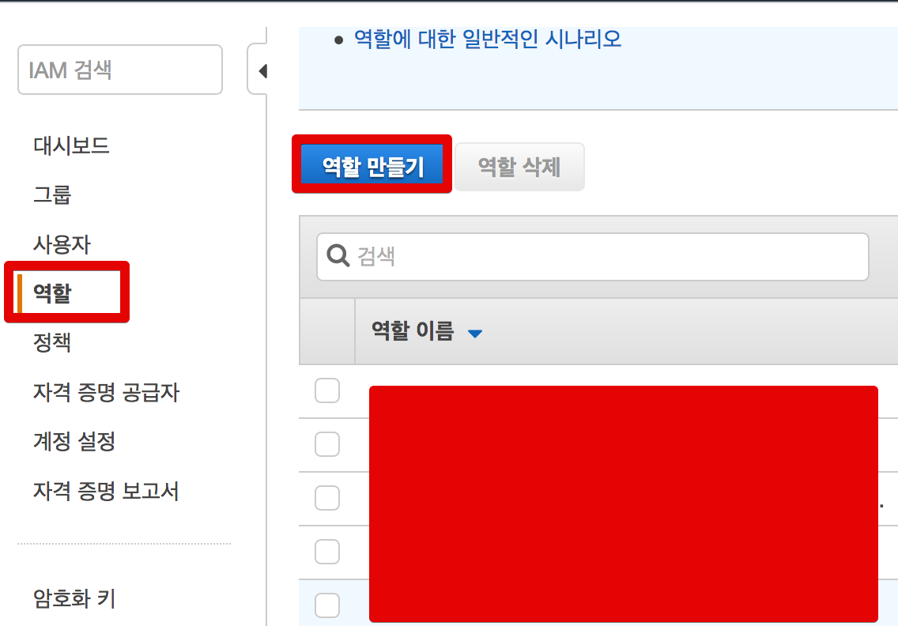

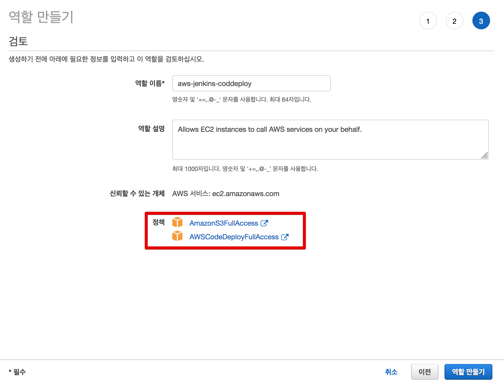

아래처럼 배포용 Jenkins와 Batch용 Jenkins 2대의 IAM Role에 새로 만든 IAM Role을 할당합니다.

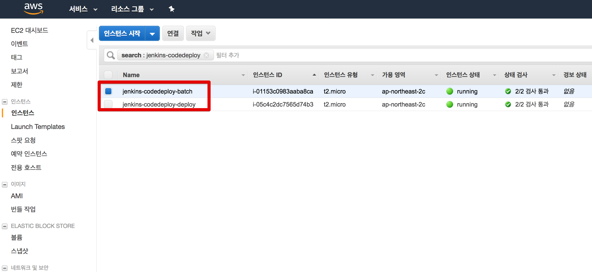


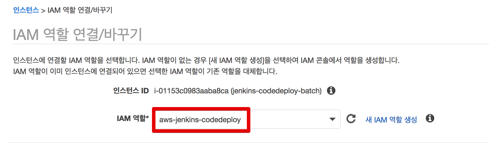

### 1-2. Code Deploy용 IAM Role 생성

추가로 **Code Deploy용 IAM Role**도 생성합니다.

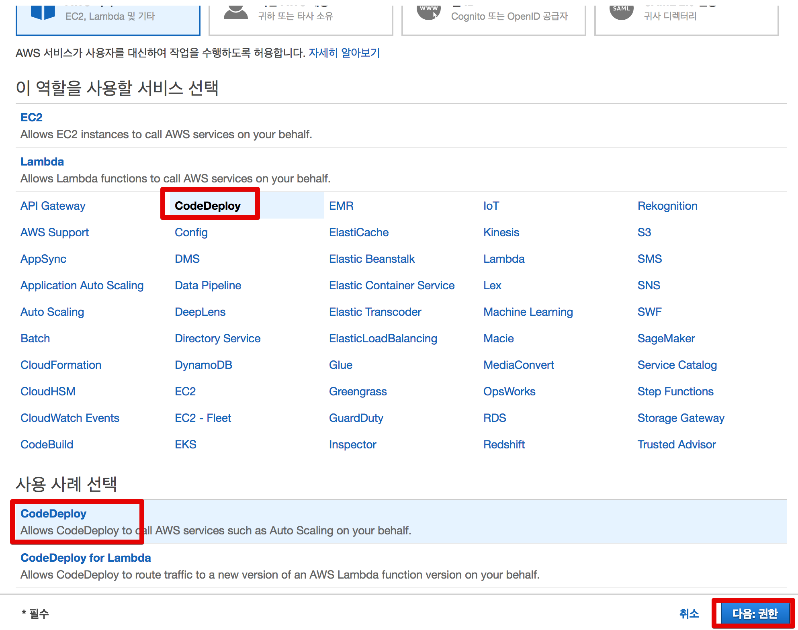

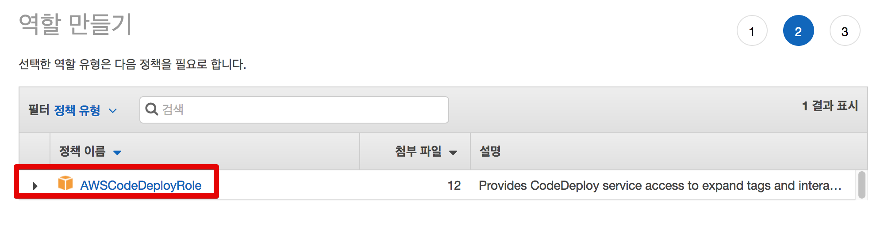

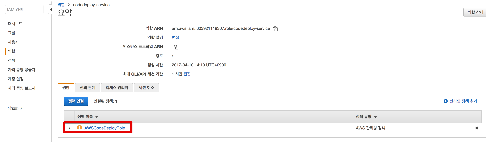


### 1-3. S3 Bucket 생성

배포할 zip 파일을 관리할 S3 Bucket도 생성합니다.

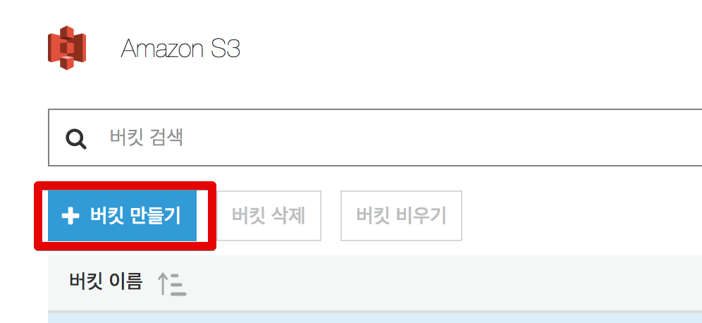

저는 bucket명을 ```dwlee-member-deploy```으로 하겠습니다.

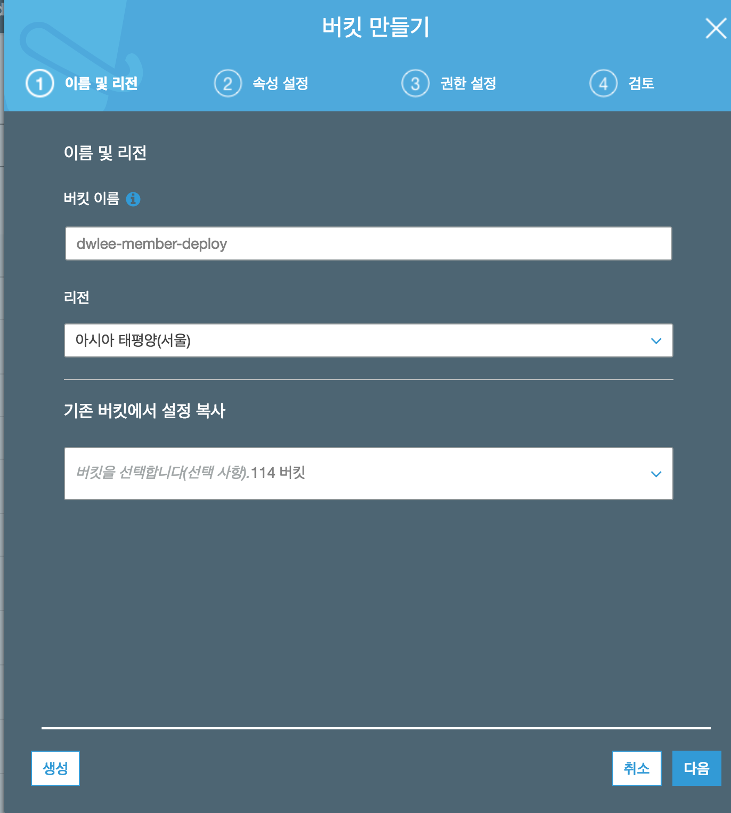

> 배포 Jenkins에서 사용해야하니 bucket명은 어딘가에 적어주시면 좋습니다.

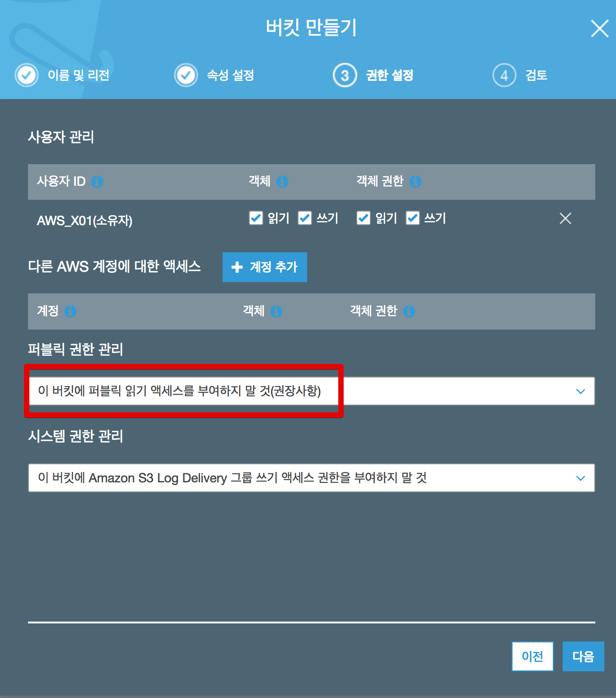

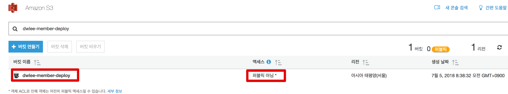

S3까지 만드셨다면 Code Deploy를 생성하겠습니다.

### 1-4. Code Deploy 생성

Code Deploy로 이동하여 애플리케이션을 생성합니다.

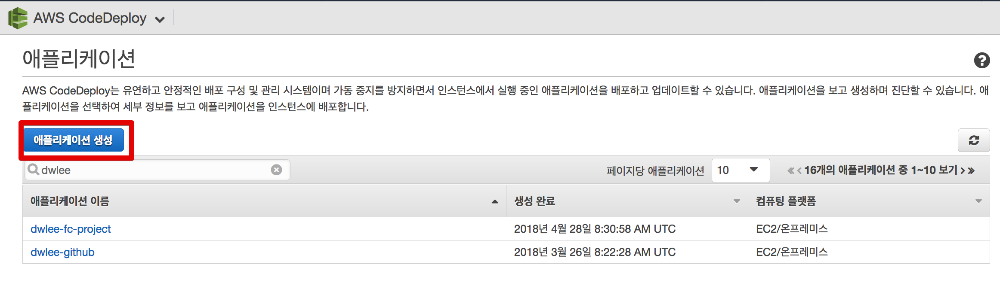

저는 Code Deploy 애플리케이션 이름을 ```dwlee-member-deploy```로 하겠습니다.

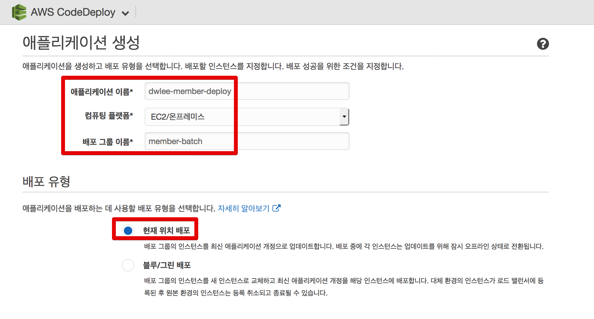

* **배포 그룹이 애플리케이션 하위**에 속합니다.
    * 간혹 이게 헷갈려 배포 그룹을 상위의 이름으로 만드는데요. 
    * 애플리케이션의 하위이기 때문에 보통은 서브모듈명을 그대로 사용하기도 합니다.

EC2 인스턴스는 Name Tag로 검색해서 찾습니다.

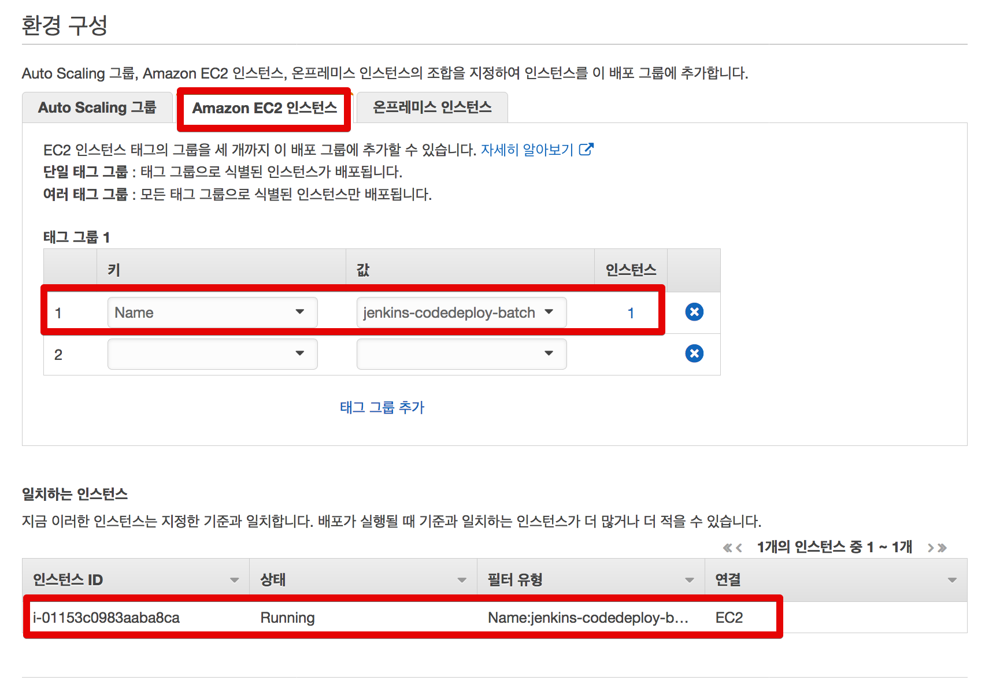

서비스 역할은 1-2 에서 만든 Code Deploy용 IAM Role을 등록합니다.

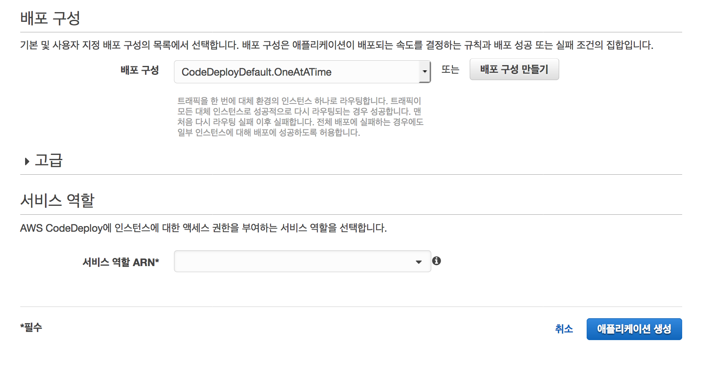

자 이렇게 하면 AWS에서 해야할 일은 모두 끝났습니다.  
그럼 간단한 배치 프로젝트를 생성하겠습니다.

## 2. 프로젝트 설정

[Gradle Multi Module](http://jojoldu.tistory.com/123) 프로젝트를 생성합니다.  
저의 경우 아래와 같이 ```jenkins-codedeploy-multi-module```란 Root 프로젝트 하위로 ```member-batch```, ```member-core```를 두었습니다.

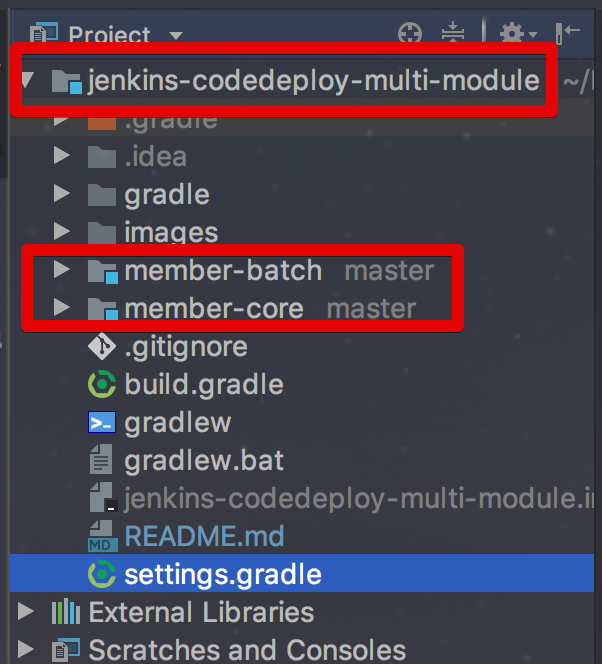

여기서는 간단한 샘플 배치 코드를 하나 작성하겠습니다.  
먼저 Spring Batch를 쓸 수 있도록 build.gradle에 의존성을 추가합니다.

```groovy
dependencies {
    compile project(':member-core')
    compile('org.springframework.boot:spring-boot-starter-batch')
    testCompile('org.springframework.boot:spring-boot-starter-test')
    testCompile('org.springframework.batch:spring-batch-test')
}
```

> 전체 코드는 [Github](https://github.com/jojoldu/jenkins-codedeploy-multi-module)을 참고해주세요!

member-batch에 간단한 샘플 배치 코드를 추가합니다.    
  
 
**SampleBatchConfiguration.java**

```java
@Slf4j
@Configuration
@ConditionalOnProperty(name = "job.name", havingValue = JOB_NAME)
public class SampleBatchConfiguration {

    public static final String JOB_NAME = "sampleBatch";

    @Autowired
    JobBuilderFactory jobBuilderFactory;

    @Autowired
    StepBuilderFactory stepBuilderFactory;

    @Value("${chunkSize:1000}")
    private int chunkSize;

    @Bean
    public Job job() {
        return jobBuilderFactory.get(JOB_NAME)
                .start(step())
                .build();
    }

    @Bean
    public Step step() {
        return stepBuilderFactory.get("step")
                .tasklet((contribution, chunkContext) -> {
                    log.info("샘플 배치입니다!");
                    return RepeatStatus.FINISHED;
                })
                .build();
    }
}
```

그리고 이를 테스트하는 코드도 추가하겠습니다.

**TestJobConfiguration.java**

```java
@EnableBatchProcessing
@Configuration
public class TestJobConfiguration {

    @Bean
    public JobLauncherTestUtils jobLauncherTestUtils() {
        return new JobLauncherTestUtils();
    }
}
```

**SampleBatchConfigurationTest.java**

```java
@RunWith(SpringRunner.class)
@SpringBootTest
@TestPropertySource(properties = "job.name=sampleBatch")
public class SampleBatchConfigurationTest {

	@Autowired
	private JobLauncherTestUtils jobLauncherTestUtils;

	@Test
	public void 샘플_배치() throws Exception {
		//given
		JobParametersBuilder builder = new JobParametersBuilder();
		builder.addString("version", LocalDateTime.now().toString());

		//when
		JobExecution jobExecution = jobLauncherTestUtils.launchJob(builder.toJobParameters());

		//then
		Assert.assertThat(jobExecution.getStatus(), Matchers.is(BatchStatus.COMPLETED));
	}
}
```

이렇게 하시면 아래와 같은 구조가 됩니다.


샘플 배치가 잘 수행되는지 테스트를 수행해보시면!

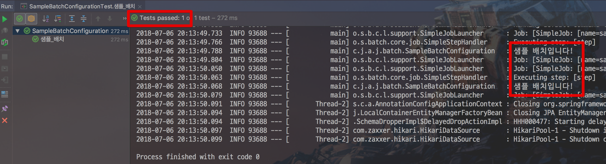

샘플 배치가 잘 수행되는 것을 알 수 있습니다!  
프로젝트의 배치 코드는 완성 되었습니다.  
이제 배포를 위한 설정 파일들을 추가하겠습니다.

### 2-1. 배포 설정 파일 추가

제일 먼저 member-batch 프로젝트 안에 code-deploy 디렉토리를 생성합니다.  
그리고 아래 그림처럼 2개의 파일을 생성합니다.  

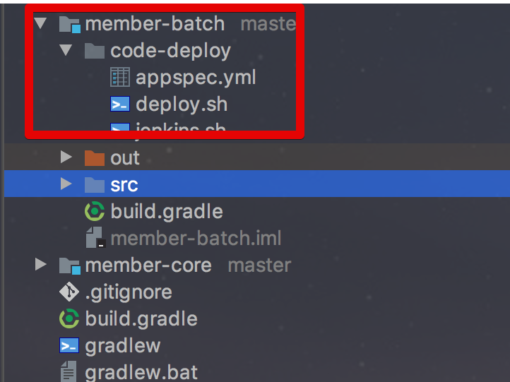

Code Deploy는 배포를 어떻게 진행할지를 ```appspec.yml```로 결정합니다.  
여기서 **jar의 권한이나 실행시킬 스크립트 등을 지정**할 수 있습니다.  
  
**appspec.yml**

```yaml
version: 0.0
os: linux
files:
  - source:  /
    destination: /home/jenkins/member-batch/deploy

permissions:
  - object: /
    pattern: "**"
    owner: jenkins
    group: jenkins

hooks:
  ApplicationStart:
    - location: deploy.sh
      timeout: 60
      runas: ec2-user
```


* ```files.destination: /home/jenkins/member-batch/deploy```
    * Code Deploy로 배포하게 되면 배포되는 서버의 ```/opt/codedeploy-agent/deployment-root/어플리케이션ID/배포그룹 ID``` 에 저장됩니다
    * 배포될 서버의 ```/home/jenkins/member-batch/deploy```로 배포 파일들을 모두 옮긴다는 의미입니다.
* ```permissions```
    * 모든 실행 권한을 ```jenkins:jenkins```로 하겠다는 의미입니다.

* ```hooks.ApplicationStart```
    * **배포 파일을 모두 옮긴 후**, 지정한 파일 (```deploy.sh```)를 실행합니다.
    * 좀 더 다양한 Event Cycle을 원하신다면 [공식 가이드](https://docs.aws.amazon.com/ko_kr/codedeploy/latest/userguide/reference-appspec-file-structure-hooks.html)를 참고하세요.

appspec.yml 생성이 끝나셨으면, 다음으로는 deploy.sh를 생성하겠습니다.  
appspec.yml과 마찬가지로 member-batch/code-deploy에 생성합니다.  
  
**deploy.sh**

```bash
ORIGIN_JAR_PATH='/home/jenkins/member-batch/deploy/*.jar'
ORIGIN_JAR_NAME=$(basename ${ORIGIN_JAR_PATH})
TARGET_PATH='/home/jenkins/member-batch/application.jar'
JAR_BOX_PATH='/home/jenkins/member-batch/jar/'

echo "  > 배포 JAR: "${ORIGIN_JAR_NAME}

echo "  > chmod 770 ${ORIGIN_JAR_PATH}"
sudo chmod 770 ${ORIGIN_JAR_PATH}

echo "  > cp ${ORIGIN_JAR_PATH} ${JAR_BOX_PATH}"
sudo cp ${ORIGIN_JAR_PATH} ${JAR_BOX_PATH}

echo "  > chown -h jenkins:jenkins ${JAR_BOX_PATH}${ORIGIN_JAR_NAME}"
sudo chown -h jenkins:jenkins ${JAR_BOX_PATH}${ORIGIN_JAR_NAME}

echo "  > sudo ln -s -f ${JAR_BOX_PATH}${ORIGIN_JAR_NAME} ${TARGET_PATH}"
sudo ln -s -f ${JAR_BOX_PATH}${ORIGIN_JAR_NAME} ${TARGET_PATH}
```

* 배포 파일들 중, jar파일을 찾아 jar를 모아두는 디렉토리 (```JAR_BOX_PATH```)로 복사
* 복사된 jar 파일의 권한을 ```jenkins:jenkins```로 변경
* 심볼릭 링크로 application.jar에 배포된 jar 파일 연결

자 이제 프로젝트 설정까지 끝이 났습니다!  
잘 되는지 Code Deploy 테스트를 한번 수행해보겠습니다!

## 3. Code Deploy 테스트

Code Deploy를 테스트하기 앞서 deploy.sh에 작성된 디렉토리들을 미리 생성하겠습니다.

### 3-1. Batch Jenkins 디렉토리 생성

Batch 젠킨스가 설치된 EC2로 접속합니다.  
젠킨스는 Spring Batch Jar를 실행할때 사용자가 jenkins인채로 실행하기 때문에 모든 파일과 디렉토리를 jenkins 사용자를 기준으로 합니다.  
(ec2-user가 아닙니다.)  
  
일단 home에 jenkins를 추가하겠습니다.

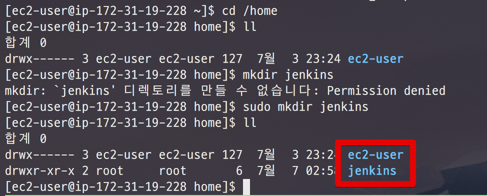

```bash
cd /home
sudo mkdir jenkins
```

그리고 하위 디렉토리를 생성합니다.

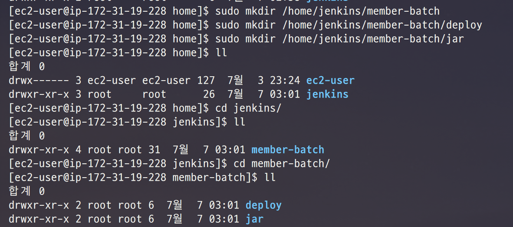

```bash
sudo mkdir /home/jenkins/member-batch
sudo mkdir /home/jenkins/member-batch/deploy
sudo mkdir /home/jenkins/member-batch/jar
```

그리고 이들의 권한을 모두 jenkins로 전환합니다.

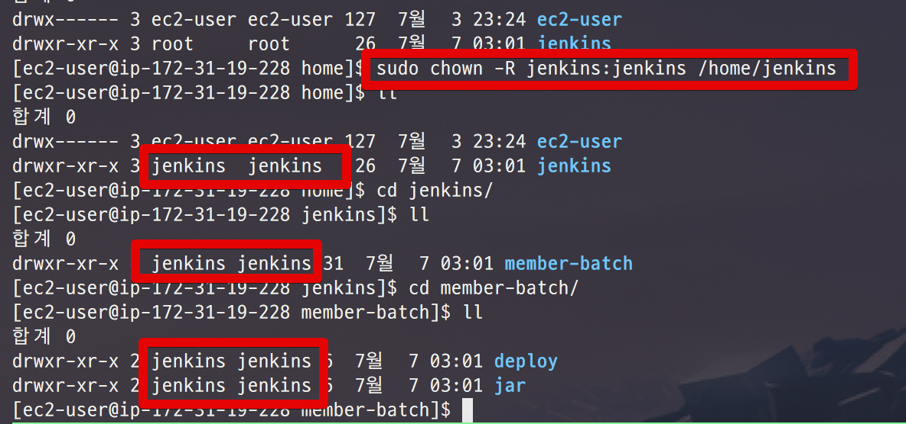

```bash
sudo chown -R jenkins:jenkins /home/jenkins
```

### 3-2. Code Deploy 테스트

## 4. 배포 Jenkins 환경 설정

배포 Jenkins에서 Github에 올라간 코드를 가져오려면 Github과 연동이 필요합니다.  

> Jenkins와 Github 연동은 [이전에 작성된 포스팅](http://jojoldu.tistory.com/291)를 참고해서 진행하시는것을 추천드립니다.

**연동이 되셨으면** 배포 Job을 생성하겠습니다.

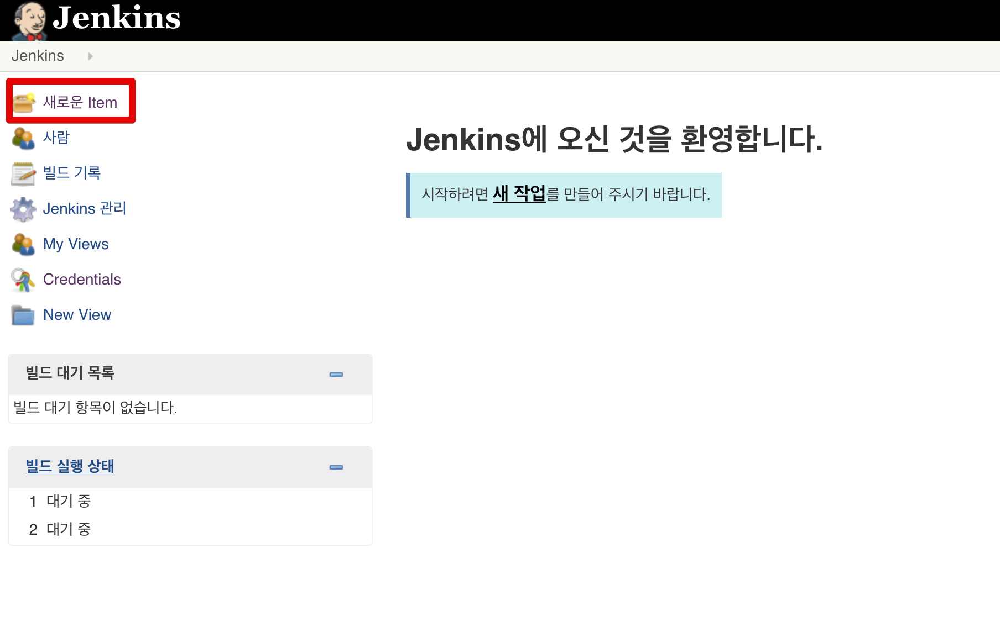

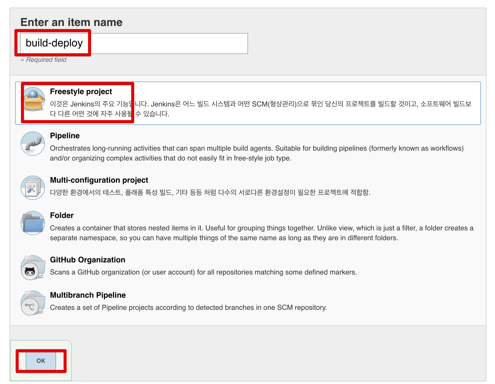

매개변수 (파라미터)에는 **Choice Parameter**를 선택합니다.

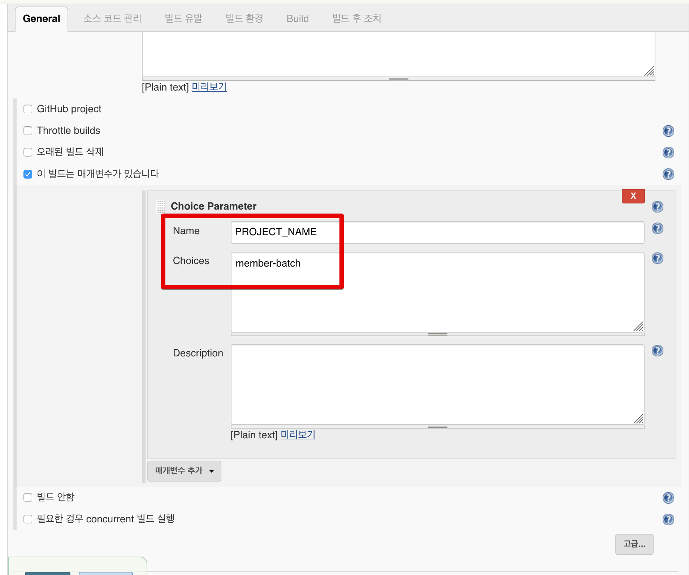

* 여기서는 member-batch 모듈만 있어서 member-batch 만 등록했지만, member-api, member-admin 등 여러 모듈이 있다면 다 등록하시면 됩니다.


소스코드 관리에서는 배포할 프로젝트의 Github 주소를 등록합니다.

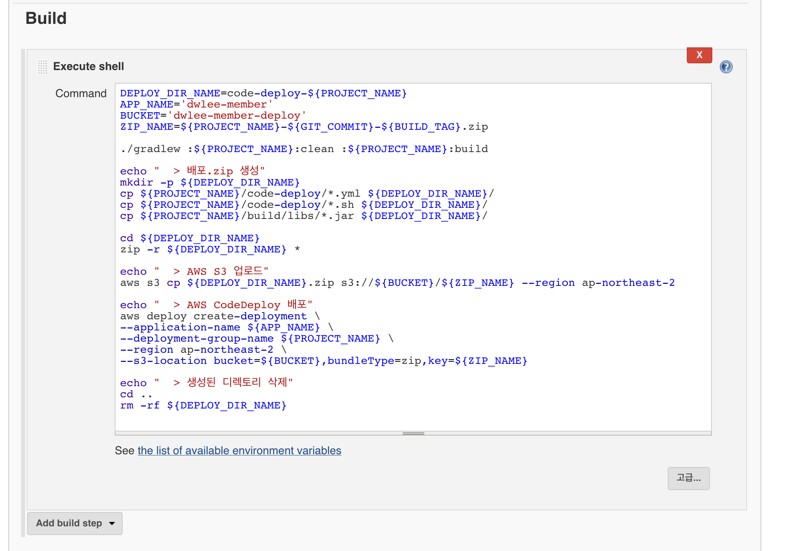

배포 스크립트 내용은 좀 길어서 아래 코드를 그대로 복사해주세요.


```bash
DEPLOY_DIR_NAME=code-deploy-${PROJECT_NAME}
APP_NAME='dwlee-member'
BUCKET='dwlee-member-deploy'
ZIP_NAME=${PROJECT_NAME}-${GIT_COMMIT}-${BUILD_TAG}.zip

./gradlew :${PROJECT_NAME}:clean :${PROJECT_NAME}:build

echo "	> 배포.zip 생성"
mkdir -p ${DEPLOY_DIR_NAME}
cp ${PROJECT_NAME}/code-deploy/*.yml ${DEPLOY_DIR_NAME}/
cp ${PROJECT_NAME}/code-deploy/*.sh ${DEPLOY_DIR_NAME}/
cp ${PROJECT_NAME}/build/libs/*.jar ${DEPLOY_DIR_NAME}/

cd ${DEPLOY_DIR_NAME}
zip -r ${DEPLOY_DIR_NAME} *

echo "	> AWS S3 업로드"
aws s3 cp ${DEPLOY_DIR_NAME}.zip s3://${BUCKET}/${ZIP_NAME} --region ap-northeast-2

echo "	> AWS CodeDeploy 배포"
aws deploy create-deployment \
--application-name ${APP_NAME} \
--deployment-group-name ${PROJECT_NAME} \
--region ap-northeast-2 \
--s3-location bucket=${BUCKET},bundleType=zip,key=${ZIP_NAME}

echo "	> 생성된 디렉토리 삭제"
cd ..
rm -rf ${DEPLOY_DIR_NAME}
```

* ```./gradlew :${PROJECT_NAME}:clean :${PROJECT_NAME}:build```
    * 멀티 모듈 프로젝트이기 때문에 **지정한 프로젝트만** ( ```${PROJECT_NAME}``` ) Build 합니다.
* 배포.zip 생성
    * 하위 프로젝트의 ```code-deploy``` 디렉토리 안에 있는 yml, sh파일과 build된 jar파일을 하나의 zip으로 묶습니다.
* AWS S3 업로드
    * S3에 배포.zip 파일을 올립니다.
* AWS CodeDeploy 배포
    * 업로드한 S3 파일로 Code Deploy 배포를 진행합니다.

자 이렇게 하면 배포 Jenkins의 설정은 끝이 납니다.


## 5. 배포 및 배치 실행
